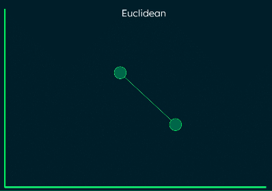
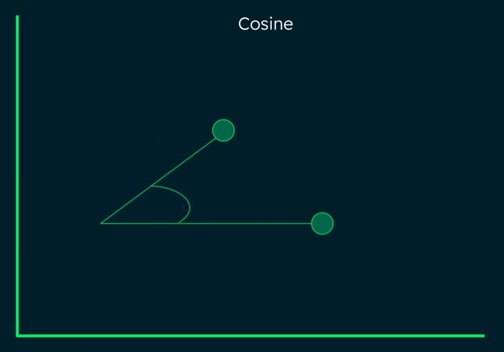
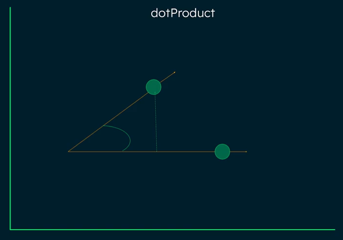

# Dimension Similarity Functions

## Configuring an Atlas Vector Index

```.bson
{
    "fields": [
        {    
            "type": "vector",
            "numDimensions": "<number-of-dimensions>",
            "similarity": "euclidean | cosine | dotProduct"
        },
        {
            "type": "filter",
            "path": "<field-to-index>"
        },

        ...

    ]
}
```

## 1. Euclidean

Euclidean distance is a similarity measure that calculates the straight-line distance between two points in a space. 

It represents the physical distance between two vectors and is primarily concerned with differences in magnitude.



### Key Characteristics

Mathematical Foundation
The measure is derived from the Pythagorean theorem, calculated as the square root of the sum of differences between two vectors.

The formula is:

$
  \begin{equation}
    d_E(i,j)
      = \left(
        \sum_{k=1}^{p}(
          x_{ik}-x_{jk}
        )^2\right
      )
    ^{\frac{1}{2}}
  \end{equation}
$

### Properties

- Scale-invariant and based purely on vector differences.
- Requires numerical data type vectors.
- Works better in lower-dimensional spaces.
- Requires data normalization for effective results.

### Use Cases

- Understanding continuous dataset structures.
- K-means clustering and classification tasks.
- Hierarchical Agglomerative clustering1
Limitations.
- Effectiveness decreases with higher dimensionality due to the curse of dimensionality.
- May not perform well with sparse data5
Sensitive to the magnitude of vectors.

---

## 2. Cosine

Cosine similarity is a mathematical metric that measures the similarity between two non-zero vectors by calculating the cosine of the angle between them in a multi-dimensional space



### Mathematical Foundation

The formula is expressed as:

$
  \begin{equation}
  \cos(\theta) = \frac{\mathbf{A} \cdot \mathbf{B}}{\|\mathbf{A}\|\|\mathbf{B}\|}
  \end{equation}
$

### Value Range

- Ranges from -1 to 1.
- Value of 1 indicates identical orientation.
- Value of 0 indicates perpendicular vectors.
- Value of -1 indicates opposite orientation.

### Advantages

**Orientation Focus:**

- Measures similarity based on direction rather than magnitude.
- Particularly effective for high-dimensional spaces.
- Less sensitive to absolute values of vector components.

**Practical Benefits:**

- Low computational complexity for sparse vectors.
- Effective for text analysis and document comparison.
- Works well in information retrieval and recommendation systems.

**Limitations:**

- May not be effective with sparse data.
- Focuses only on orientation, ignoring absolute magnitudes.
- Requires non-zero vectors in an inner product space.

---

## 3. dotProduct

The dot product similarity is a fundamental metric that measures the similarity between vectors by calculating the sum of their corresponding element products.



### Mathematically

The formula is expressed as:

$
  \begin{equation}
    \text{dotProduct} = \mathbf{A} \cdot \mathbf{B} = \sum_{i=1}^n a_i b_i
  \end{equation}
$

### Value-Range

- Ranges from negative infinity to positive infinity.
- Positive values indicate vectors pointing in similar directions.
- Zero indicates perpendicular (orthogonal) vectors.
- Negative values indicate opposing directions.

## Key Characteristics

- **Scale Sensitivity:**

> - Affected by both vector magnitude and direction.
> - Larger values indicate greater similarity.
> - Sensitive to the absolute size of vector components.

- **Applications:**

> - Commonly used in Large Language Models.
> - Effective for recommendation systems using collaborative filtering.
> - Particularly useful when vector magnitude carries meaningful information.

### Relationship to Cosine Similarity

The dot product is closely related to cosine similarity through the formula:

$
  \begin{equation}
    \mathbf{A} \cdot \mathbf{B} = \|\mathbf{A}\|\|\mathbf{B}\|\cos(\theta)
  \end{equation}
$

Where θ is the angle between the vectors. This relationship shows that dot product combines both directional similarity and magnitude information in its measurement.

---

---

# Code Summary: Implementing Hybrid Search

## Implement Hybrid Search

The following code uses the $vectorSearch and $search aggregation stages to perform a hybrid search.

```py
vector_search = {
    "$vectorSearch": {
        "index":          "vectorPlotIndex",
        "path":           "plot_embedding",
        "queryVector":    embedding,
        "numCandidates":  num_candidates,
        "limit":          limit
    }
}

make_array = {
    "$group": { "_id": None, "docs": {"$push": "$$ROOT"} }
}

add_rank = {
    "$unwind": { "path": "$docs", "includeArrayIndex": "rank" }
}

def make_compute_score_doc(priority, score_field_name):
    return {
        "$addFields": {
            score_field_name: {
                "$divide": [
                    1.0,
                    { "$add": ["$rank", priority, 1] }
                ]
            }
        }
    }

def make_projection_doc(score_field_name):
    return  {
        "$project": {
            score_field_name:  1,
            "_id":             "$docs._id",
            "title":           "$docs.title",
            "plot":            "$docs.plot",
            "year":            "$docs.year",
        }
    }


text_search = {
    "$search": {
        "index":  "plotIndex",
        "text":   { "query": query, "path": "plot" },
    }
}

limit_results = {
    "$limit" : limit
}

combine_search_results = {
    "$group": {
        "_id":        "$_id",
        "vs_score":   {"$max":    "$vs_score"},
        "ts_score":   {"$max":    "$ts_score"},
        "title":      {"$first":  "$title"},
        "plot":       {"$first":  "$plot"},
        "year":       {"$first":  "$year"}
    }
}

project_combined_results = {
    "$project": {
        "_id":        1,
        "title":      1,
        "plot":       1,
        "year":       1,
        "score": {
            "$let": {
                "vars": {
                    "vs_score":  { "$ifNull":  ["$vs_score", 0] },
                    "ts_score":  { "$ifNull":  ["$ts_score", 0] }
                },
                "in": { "$add": ["$$vs_score", "$$ts_score"] }
            }
        }
    }
}

sort_results = {
    "$sort": { "score": -1}
}

pipeline = [
    vector_search,
    make_array,
    add_rank,
    make_compute_score_doc(vector_priority, "vs_score"),
    make_projection_doc("vs_score"),
    {
        "$unionWith": { "coll": "movies",
            "pipeline": [
                text_search,
                limit_results,
                make_array,
                add_rank,
                make_compute_score_doc(text_priority, "ts_score"),
                make_projection_doc("ts_score")
            ]
        }
    },
    combine_search_results,
    project_combined_results,
    sort_results,
    limit_results
]

x = collection.aggregate(pipeline)

```

